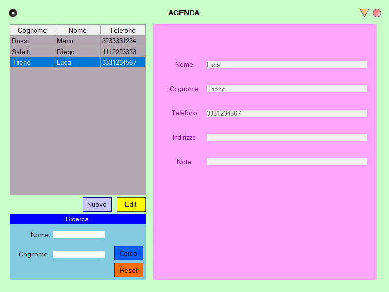

# Agenda-01
Agenda-01 is a program that allows you to save people by giving them:
name, surname, telephone, then if you want you can add an address and a note.
Sorts names alphabetically by last name and then first name.

# Agenda-02
The program is the same as agenda-01 but has an implementation
that allows you to search a person with the first and/or last name.

