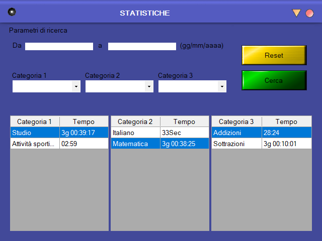

# PWK-ACT-TMR-01
It's a program that allows you to choose categories/activities
and activate the stopwatch, there are statistics that tell you
how much time you've spent in different activities. You can also
enter times if you forgot to do so and you can also put a comment 
on your time.

[Download PWK-ACT-TMR-01](https://github.com/AbdullahXPlab/POWER-KI-APPS/raw/main/PWK-ACT-TMR-01/PWK-ACT-TMR-01.pwk)
 
